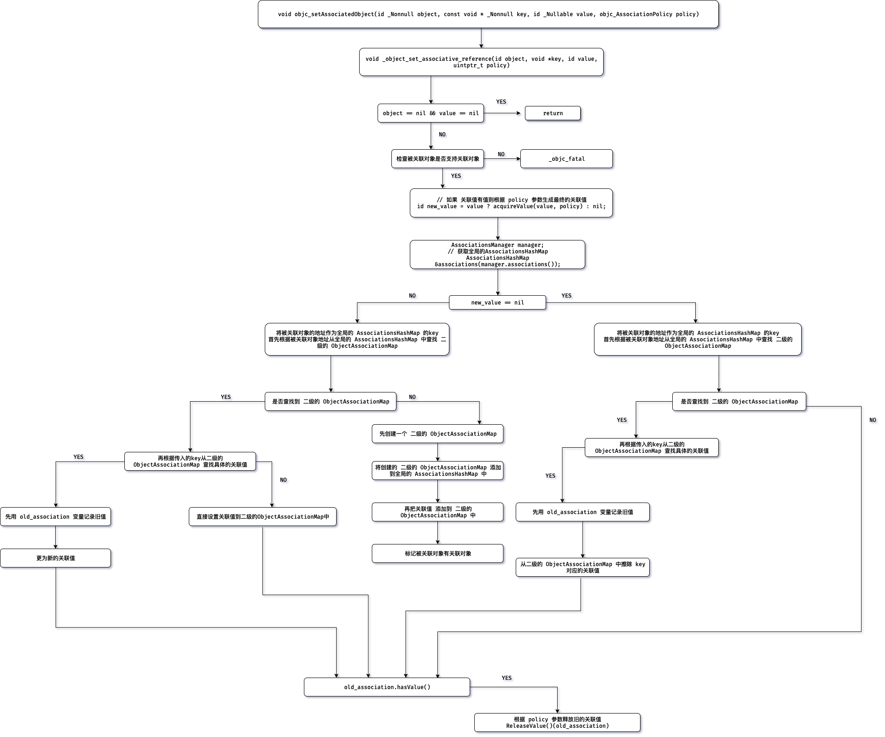

## 如何使用?

- 首先需要导入 `<objc/runtime.h>` 头文件
- 然后通过 `runtime` 如下 `API`

    ```objc
    // 为 object 设置关联值
    OBJC_EXPORT void
    objc_setAssociatedObject(id _Nonnull object, const void * _Nonnull key,
                             id _Nullable value, objc_AssociationPolicy policy)
        OBJC_AVAILABLE(10.6, 3.1, 9.0, 1.0, 2.0);
    
    // 获取 object 关联值
    OBJC_EXPORT id _Nullable
    objc_getAssociatedObject(id _Nonnull object, const void * _Nonnull key)
        OBJC_AVAILABLE(10.6, 3.1, 9.0, 1.0, 2.0);
    
    // 移除 object 所有关联值
    OBJC_EXPORT void
    objc_removeAssociatedObjects(id _Nonnull object)
        OBJC_AVAILABLE(10.6, 3.1, 9.0, 1.0, 2.0);
    ```

- 示例代码一

    ```objc
    #import <Foundation/Foundation.h>
    #import <objc/runtime.h>
    
    @interface CustomObject : NSObject
    
    @end
    
    @implementation CustomObject
    
    @end
    
    int main(int argc, const char *argv[]) {
    
        CustomObject *obj = [[CustomObject alloc] init];
        const char *key   = "name";
        NSString *value   = @"0x1306a94";
        objc_setAssociatedObject(obj, key, value, OBJC_ASSOCIATION_COPY_NONATOMIC);
    
        NSLog(@"name is: %@", objc_getAssociatedObject(obj, key)); // name is: 0x1306a94
    
        return 0;
    }
    ```

- 示例代码二, 为 `category` 实现 `property`

    ```objc
    #import <Foundation/Foundation.h>
    #import <objc/runtime.h>
    
    @interface CustomObject : NSObject
    
    @end
    
    @implementation CustomObject
    
    @end
    
    @interface CustomObject (Ext)
    @property (nonatomic, copy) NSString *name;
    @end
    
    @implementation CustomObject (Ext)
    
    static void *key = &key; // key 写法
    - (void)setName:(NSString *)name {
    		// objc_setAssociatedObject(self, key, name, OBJC_ASSOCIATION_COPY_NONATOMIC);
    
    		// 写法二,使用 getter selector, 推荐写法
        objc_setAssociatedObject(self, @selector(name), name, OBJC_ASSOCIATION_COPY_NONATOMIC);
    }
    
    - (NSString *)name {
    		// return objc_getAssociatedObject(self, key);
    
    		// _cmd 为每个方法的第二个隐式参数, 推荐写法
        return objc_getAssociatedObject(self, _cmd);
    }
    @end
    
    int main(int argc, const char *argv[]) {
    
        CustomObject *obj = [[CustomObject alloc] init];
        obj.name          = @"0x1306a94";
        NSLog(@"name is: %@", obj.name);  // name is: 0x1306a94
    
        return 0;
    }
    ```

## 源码窥探实现原理

本文基于 `objc4-756.2.tar.gz` 源码分析, 具体源码文件为 `objc-references.mm`

- 首先是 `objc_setAssociatedObject`的原理  `objc_setAssociatedObject` 实际内部是调用的 `_object_set_associative_reference`

    ```objc
    void _object_set_associative_reference(id object, void *key, id value, uintptr_t policy) {
        // This code used to work when nil was passed for object and key. Some code
        // probably relies on that to not crash. Check and handle it explicitly.
        // rdar://problem/44094390
        
        // 如果被关联的对象和关联的值都没有,则什么也不做
        if (!object && !value) return;
        
        assert(object);
        
        // 检查被关联对象是否支持关联对象
        if (object->getIsa()->forbidsAssociatedObjects())
            _objc_fatal("objc_setAssociatedObject called on instance (%p) of class %s which does not allow associated objects", object, object_getClassName(object));
        
        // retain the new value (if any) outside the lock.
        // 用于记录旧的关联值
        ObjcAssociation old_association(0, nil);
        
        // 如果 关联值有值则根据 policy 参数生成最终的关联值
        id new_value = value ? acquireValue(value, policy) : nil;
        {
            AssociationsManager manager;
            // 获取全局的AssociationsHashMap
            AssociationsHashMap &associations(manager.associations());
            // 将被关联对象的地址作为全局的 AssociationsHashMap 的key
            disguised_ptr_t disguised_object = DISGUISE(object);
            if (new_value) { // 如果关联值 有值
                // break any existing association.
                // 首先根据被关联对象地址从全局的 AssociationsHashMap 中查找 二级的 ObjectAssociationMap
                AssociationsHashMap::iterator i = associations.find(disguised_object);
                if (i != associations.end()) {
                    // secondary table exists
                    // 如果找到了 二级的 ObjectAssociationMap
                    ObjectAssociationMap *refs = i->second;
                    // 则再根据传入的key从二级的 ObjectAssociationMap 查找具体的关联值
                    ObjectAssociationMap::iterator j = refs->find(key);
                    if (j != refs->end()) {
                        // 如果找到
                        // 先记录旧的关联值
                        old_association = j->second;
                        // 然后再直接更新 关联值为新值
                        j->second = ObjcAssociation(policy, new_value);
                    } else {
                        // 没有被设置过关联值,则直接设置关联值
                        (*refs)[key] = ObjcAssociation(policy, new_value);
                    }
                } else {
                    // create the new association (first time).
                    // 如果没有找到 二级的 ObjectAssociationMap
                    // 则先创建一个 二级的 ObjectAssociationMap
                    ObjectAssociationMap *refs = new ObjectAssociationMap;
                    // 将创建的 二级的 ObjectAssociationMap 添加到全局的 AssociationsHashMap 中
                    associations[disguised_object] = refs;
                    // 再把关联值 添加到 二级的 ObjectAssociationMap 中
                    (*refs)[key] = ObjcAssociation(policy, new_value);
                    // 标记被关联对象有关联对象
                    object->setHasAssociatedObjects();
                }
            } else { // 如果关联值为空
                // setting the association to nil breaks the association.
                // 首先根据被关联对象地址从全局的 AssociationsHashMap 中查找 二级的 ObjectAssociationMap
                AssociationsHashMap::iterator i = associations.find(disguised_object);
                if (i !=  associations.end()) {
                    ObjectAssociationMap *refs = i->second;
                    // 如果找到了 二级的 ObjectAssociationMap
                    // 则再根据传入的key从二级的 ObjectAssociationMap 查找具体的关联值
                    ObjectAssociationMap::iterator j = refs->find(key);
                    if (j != refs->end()) {
                        // 记录旧的关联值
                        old_association = j->second;
                        // 从二级的 ObjectAssociationMap 中擦除 key 对应的关联值
                        refs->erase(j);
                    }
                }
            }
        }
        // release the old value (outside of the lock).
        // 如果旧的关联值有值, 则根据 policy 参数释放旧的关联值
        if (old_association.hasValue()) ReleaseValue()(old_association);
    }
    ```

- 设置关联值流程图



- `objc_getAssociatedObject` 原理 `objc_getAssociatedObject` 实际内部是调用的 `_object_get_associative_reference`

    ```objc
    id _object_get_associative_reference(id object, void *key) {
        id value = nil;
        uintptr_t policy = OBJC_ASSOCIATION_ASSIGN;
        {
            AssociationsManager manager;
            // 获取全局的AssociationsHashMap
            AssociationsHashMap &associations(manager.associations());
            // 将被关联对象的地址作为全局的 AssociationsHashMap 的key
            disguised_ptr_t disguised_object = DISGUISE(object);
            // 根据被关联对象地址从全局的 AssociationsHashMap 中查找 二级的 ObjectAssociationMap
            AssociationsHashMap::iterator i = associations.find(disguised_object);
            if (i != associations.end()) {
                // 如果找到了 二级的 ObjectAssociationMap
                ObjectAssociationMap *refs = i->second;
                // 则再根据传入的key从二级的 ObjectAssociationMap 查找具体的关联值
                ObjectAssociationMap::iterator j = refs->find(key);
                if (j != refs->end()) {
                    // 拿到最终的关联值
                    ObjcAssociation &entry = j->second;
                    value = entry.value();
                    policy = entry.policy();
                    // 根据 policy 值,判断是否需要进行 retain
                    if (policy & OBJC_ASSOCIATION_GETTER_RETAIN) {
                        objc_retain(value);
                    }
                }
            }
        }
        // 检查是否需要进行 autorelease
        if (value && (policy & OBJC_ASSOCIATION_GETTER_AUTORELEASE)) {
            objc_autorelease(value);
        }
        // 返回查找到的 关联值
        return value;
    }
    ```

- `objc_removeAssociatedObjects` 原理 `objc_removeAssociatedObjects`首先会检查 `被关联对象是否有值, 是否被标记过有关联对象`

    ```objc
    void objc_removeAssociatedObjects(id object) 
    {
        if (object && object->hasAssociatedObjects()) {
            _object_remove_assocations(object);
        }
    }
    ```

    ```Objective-C
    void _object_remove_assocations(id object) {
        // 记录所有的关联值
        vector< ObjcAssociation,ObjcAllocator<ObjcAssociation> > elements;
        {
            AssociationsManager manager;
            // 首先拿到全局的 AssociationsHashMap
            AssociationsHashMap &associations(manager.associations());
            // 如果全局的 AssociationsHashMap 中没有元素 则什么也不做
            if (associations.size() == 0) return;
            // 将被关联对象的地址作为全局的 AssociationsHashMap 的key
            disguised_ptr_t disguised_object = DISGUISE(object);
            // 根据被关联对象地址从全局的 AssociationsHashMap 中查找 二级的 ObjectAssociationMap
            AssociationsHashMap::iterator i = associations.find(disguised_object);
            if (i != associations.end()) {
                // copy all of the associations that need to be removed.
                ObjectAssociationMap *refs = i->second;
                for (ObjectAssociationMap::iterator j = refs->begin(), end = refs->end(); j != end; ++j) {
                    // 将二级的 ObjectAssociationMap 中的每一个元素,保存到 elements 中
                    elements.push_back(j->second);
                }
                // remove the secondary table.
                // 释放二级的 ObjectAssociationMap 内存
                delete refs;
                // 从全局的 AssociationsHashMap 中移除这个 二级的 ObjectAssociationMap
                associations.erase(i);
            }
        }
        // the calls to releaseValue() happen outside of the lock.
        // 释放从二级的 ObjectAssociationMap 中查找到的 所有关联值
        for_each(elements.begin(), elements.end(), ReleaseValue());
    }
    ```

## 总结:

- 实现关联对象的核心由 `AssociationsManager` `AssociationsHashMap` `ObjectAssociationMap` `ObjcAssociation` 组成
- `关联值并不是存储在被关联对象本身内存中`
- 关联对象存储在全局的统一的一个 `AssociationsManager` 中
- 设置关联对象为 `nil` 就相当于是 `移除关联值`
